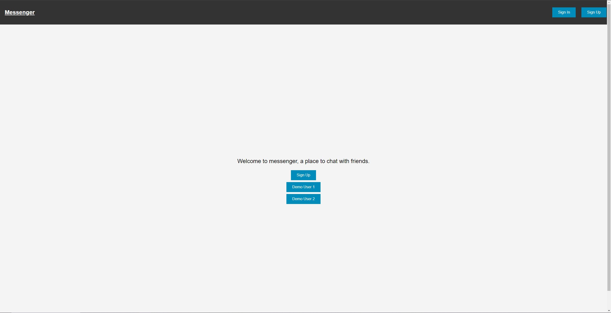
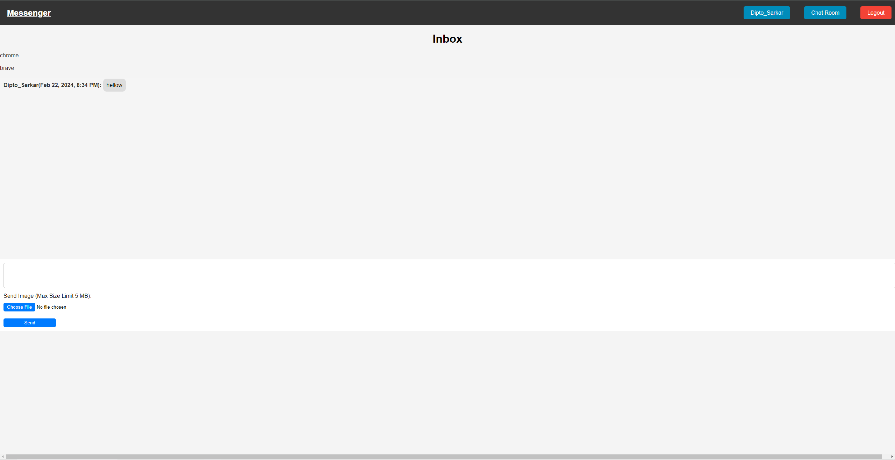

# Messaging_App_SSR
This is a simple messaging app using Server Side Rendering (SSR) with Node.js, Express.js and mongodb as database. It includes user sign in and sign up, the ability to send and receive messages with images, adding friends, accept or reject friend request. The application is built as part of the curriculum for The Odin Project. Live demo https://messaging-app-cd9a.onrender.com. If this link takes too long to load, try this one https://messaging-app.adaptable.app/

## Features

- User sign in and sign up
- Send and receive messages with images
- Add friends
- Accept or reject friend request

## Screenshots




## Future Features

- Implement real-time chatting functionality using socket.io
- Integrate a frontend framework like React or MarkoJS for enhanced UI and interactivity
- Improve the visual appeal with CSS styling to make the application look good
- Improve the error handling

## Installation

1. Clone the repository
2. Install dependencies
   ```sh
   npm install
   ```
3. Create a `.env` file in the root directory and add the following environment variables
   ```sh
    MONGODB_URI=your_mongodb_uri
    SESSION_SECRET=your_session_secret
    CLOUDINARY_NAME=your_cloudinary_name
    CLOUDINARY_API_KEY=your_cloudinary_api_key
    CLOUDINARY_API_SECRET=your_cloudinary_api_secret
    ```
4. Start the server
    ```sh
    npm run dev
    ```
5. Open your browser and navigate to `http://localhost:3000`